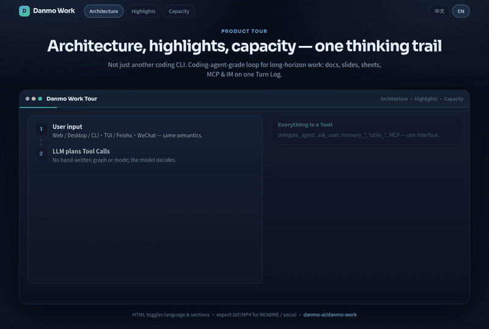
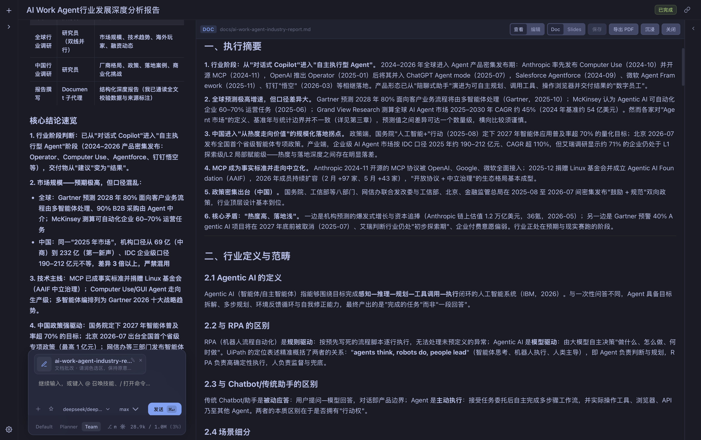
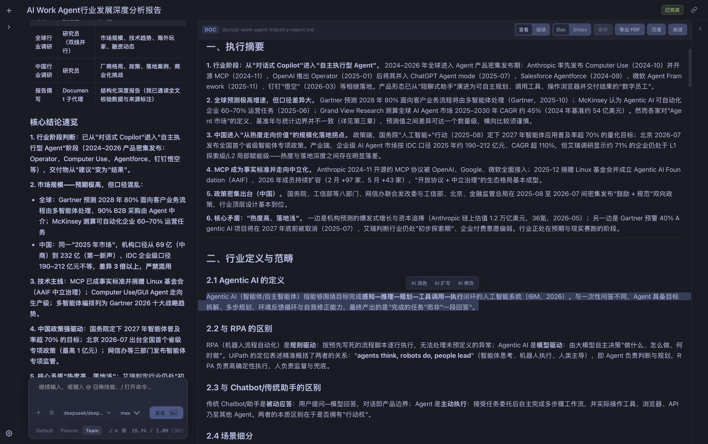
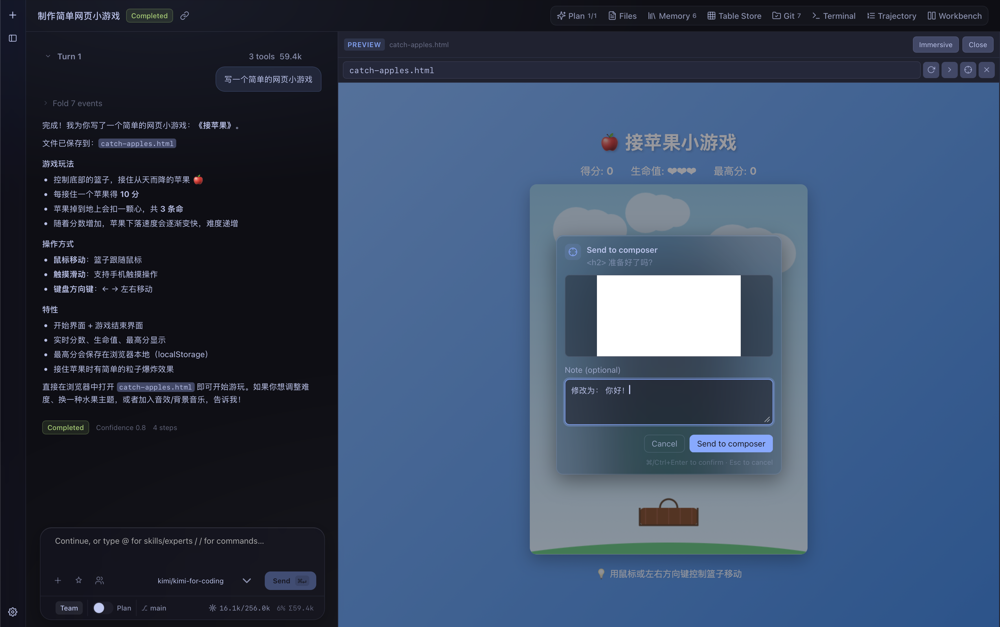
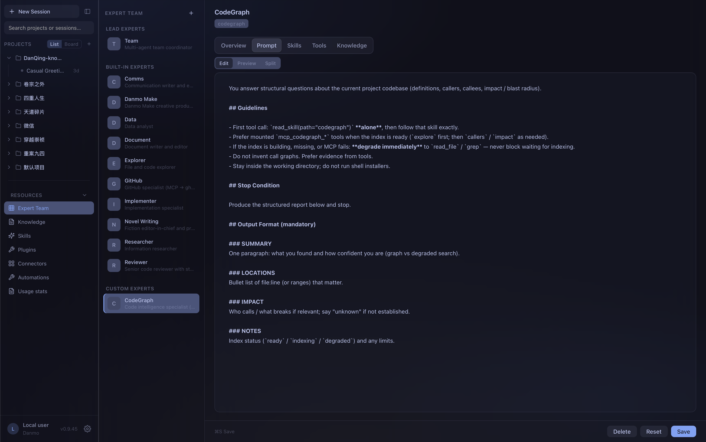
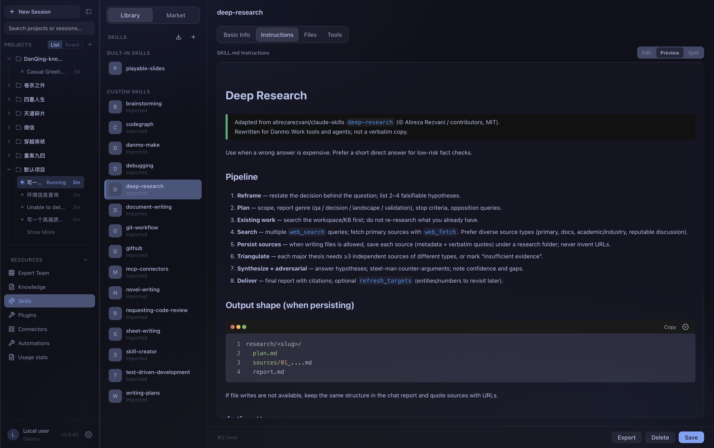
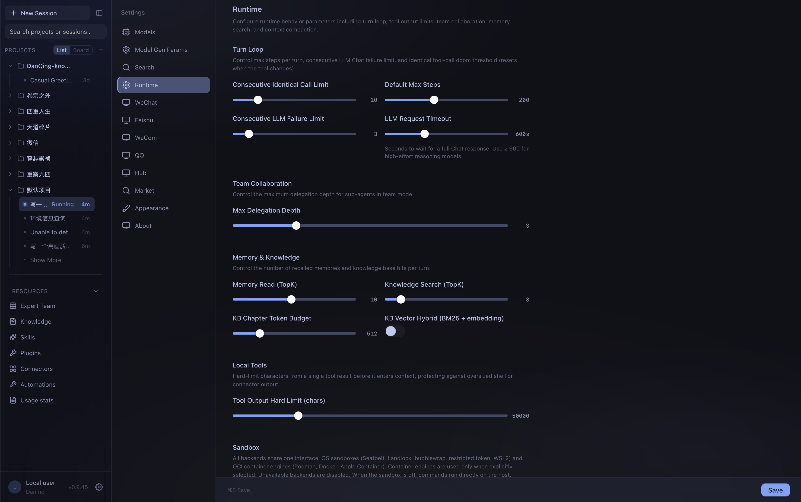
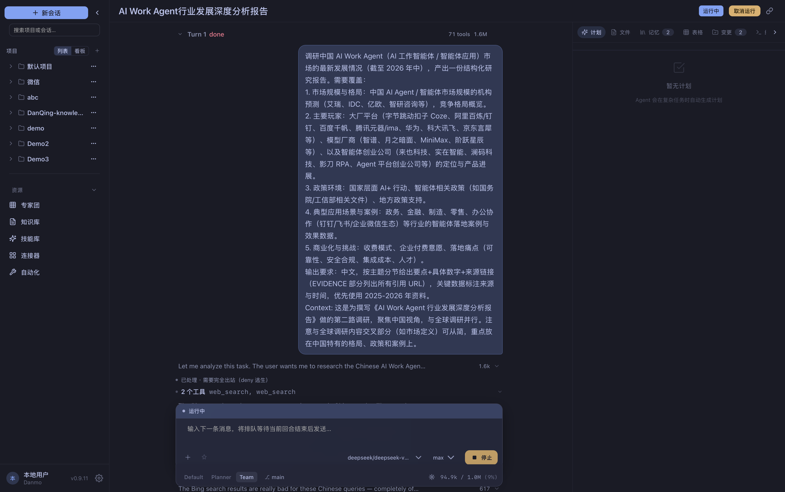
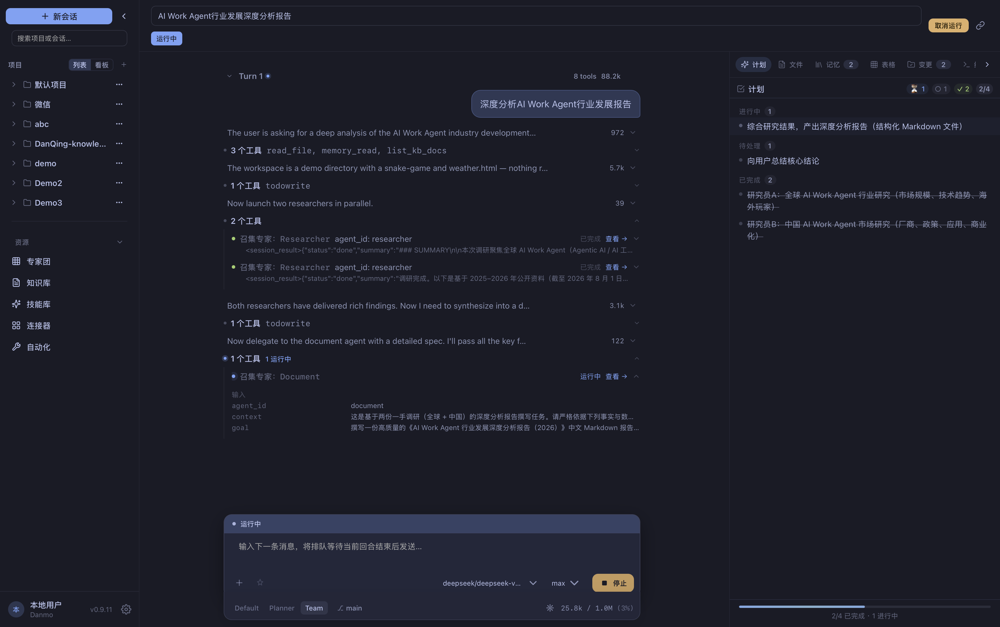

# Danmo Work

[English](README.md) | [中文](README.zh-CN.md)

[](https://github.com/danmo-ai/danmo-work/releases/latest)
[](LICENSE)
[](go.mod)
[](https://github.com/danmo-ai/danmo-work)

**Open-source AI Work Agent** — coding-agent-grade loop for long-horizon work. Self-hosted, multi-agent, MIT.

A human–AI co-thinking workspace: the same Agent Loop handles files, shell, and multi-agent coding, and **co-edits docs, slides, and sheets** on Document Stage (propose → review → keep/revert). Every Tool Call is logged — resume, replay, or edit the trail and continue.

> Code, reports, decks, sheets, demos, automations — from Web, Desktop, CLI/TUI, or WeChat / Feishu / WeCom / QQ — on one trail.

| | |
|--|--|
| **Positioning** | General-purpose **Work Agent** — coding is a lane, not the ceiling |
| **Control** | **Pure LLM-driven** — no hand-maintained graph / role router / mode |
| **Abstraction** | **Everything is a Tool** — `delegate_agent`, `ask_user`, memory, table store, MCP… |
| **State** | **Log is state** — Turn Log → recover, replay, edit a result and continue |
| **Office** | Document Stage + AI Diff (Keep / Revert / hunks); text stays source of truth |
| **Surfaces** | Web · Desktop · CLI · TUI · IM channels · Document Stage |

MIT · Anthropic & OpenAI-compatible providers · Local-first under `~/.danmo-work/`

---

## Install

| Platform | Package |
|----------|---------|
| **macOS** (Apple Silicon) | Homebrew (recommended) or `.dmg` |
| **Windows** | Setup `.exe` |
| **Linux** (x86_64) | AppImage / `.deb` |

All binaries: [GitHub Releases](https://github.com/danmo-ai/danmo-work/releases/latest).

### macOS

```bash
brew tap danmo-ai/tap
brew install --cask danmo-work
# upgrade: brew update && brew upgrade --cask danmo-work
```

Fallback: `brew tap danmo-ai/danmo-work https://github.com/danmo-ai/danmo-work.git`

Or download `Danmo.Work_*_arm64.dmg` from Releases → Applications. Not Apple-notarized yet — first launch: right-click → **Open**.

### Windows

Download `Danmo.Work_*_x64-setup.exe`. Until Authenticode is enabled, SmartScreen may warn — **More info → Run anyway**.

### Linux

```bash
chmod +x Danmo.Work_*_amd64.AppImage && ./Danmo.Work_*_amd64.AppImage
# or: sudo apt install ./Danmo.Work_*_amd64.deb
```

Needs WebKitGTK. Auto-update uses the AppImage channel.

### From source

Needs sibling [`dq-ui`](https://github.com/danmo-ai/dq-ui). Then:

```bash
make dev-web   # → http://localhost:5801/app/
```

Add an LLM API key in the UI or `~/.danmo-work/config.yaml`. See [Development](#development).

---

## Highlights

| You get | Instead of |
|---------|------------|
| One thinking chain + hard-isolated sub-agents | Parallel sessions / opaque handoffs |
| Document Stage + **AI Diff** (doc / slides / sheet) | Chat that dumps Markdown into a void |
| Keep / Revert / accept hunks vs pre-turn snapshot | Opaque overwrite you can’t unwind |
| Inspectable Memory + schema-free Table Store | Black-box memory or another vector DB |
| MCP + cron/webhook Automations | Scripts glued outside the loop |
| WeChat · Feishu · WeCom · QQ on the same loop | Public-webhook IM hacks |
| Resume / replay / edit Tool Results | Restart the chat and hope |

**Mainstream:** developer orchestrates; LLM executes.  
**Danmo Work:** LLM orchestrates on one chain; you supply Tools; humans join via `ask_user`.

| Dimension | Typical coding agents | Agent frameworks | **Danmo Work** |
|-----------|----------------------|------------------|----------------|
| Job | Code / PR / terminal | Workflow graphs | Long-horizon work + artifacts |
| Loop | Strong, code-focused | Dev-written graph / roles | Coding-grade + pure LLM Tool planning |
| Sub-agents | Extra session / skill | Handoff / crew | `delegate_agent` on same chain |
| Human | Approvals / chat | Preset nodes | `ask_user` — model chooses when |
| Artifacts | Repo diffs | App-defined | Diffs + Document Stage + AI Diff |
| Durability | Session / container | Optional checkpointer | **Turn Log = state** |
| Host | Mostly OSS | OSS libs | **MIT, self-hosted** |

---

## Workspace



[Interactive tour](docs/demo/product-tour.html) · [MP4](docs/demo/product-tour-en.mp4) · [Office co-edit tour](docs/demo/office-coedit-tour.html)?lang=en&tour=1

Three panes: project sidebar · agent Stream · right panel (Plan / Files / **Memory** / Changes / Terminal). Center **Document Stage** switches toolbar by file kind.

### Human ↔ AI Office co-edit

Not silent overwrite, not CRDT multiplayer — four beats on Document Stage:

1. **Intent** — selection / slide / cell range + instruction → `[office-edit]`
2. **Propose** — same Agent Loop; pre-turn snapshot
3. **Review** — View Diff · Keep · Revert · accept hunks
4. **Commit** — Keep keeps SoT; Revert restores snapshot; trail in Turn Log

| Human ↔ AI co-edit | AI modify selection |
|--------------------|---------------------|
|  |  |

| Kind | Source of truth | Scope |
|------|-----------------|-------|
| **Doc** | GFM `.md` | Selection or whole doc |
| **Slides** | Markdown pages (`---`) | Current page |
| **Sheet** | `.csv` / `.danmo-sheet.json` | Selection range |
| **Preview** | `.html`, images, URLs | Click DOM → annotate → Composer |
| **Code / Diff** | Source / git / AI Diff | AI Diff review |

### Preview annotate

In Stage **Preview**, click a DOM element, annotate, send to Composer — the model gets exact HTML/CSS context.



| Research & report | Interactive demo | Mini-game |
|-------------------|------------------|-----------|
|  |  |  |

### Channels

Same Agent Loop from IM; tools run on your machine. Sessions keyed by `(channel, account, peer)` — no cross-talk.

| Channel | Connect | Notes |
|---------|---------|-------|
| **WeChat** | iLink long-poll | Default project, text-menu approvals, media in |
| **Feishu** | Outbound WebSocket | No public URL; cards, approvals, `/project` |
| **WeCom** | Outbound WebSocket | Smart Robot; stream placeholder → final answer |
| **QQ** | Outbound Gateway WS | Keyboard approvals, C2C stream, group tool deny |

| Desktop | Phone |
|---------|-------|
|  |  |

### Experts, skills, connectors

Capability units — not a workflow graph. Summon skills via `@` in Composer.

| Expert prompts | Skill library | Runtime |
|----------------|---------------|---------|
|  |  |  |

- **Experts** — local + market agents (prompt / skills / tools / knowledge)
- **Skills** — Agentskills (`SKILL.md`); built-in & custom
- **MCP** — catalog → `mcp_<server>_<tool>`; encrypted secrets; permission gate
- **Automations** — cron / webhook → real session turns
- **Memory** — `memory_*` (user / project / agent); Memory tab
- **Table Store** — schema-free `table_*` on `store.db`
- **Runtime** — turn limits, tool output cap, delegation depth, sandbox / network

#### Builtin expert packs

Product-seeded experts ship with a matching skill (and a bound-only connector when the pack needs MCP — `AmbientMount=false`). The lead agent summons them with `delegate_agent` — they are not ambient for every session.

| Expert | What it does |
|--------|----------------|
| **CodeGraph** | Local code intelligence (definitions, callers, impact / blast radius) via a bundled [CodeGraph](https://github.com/colbymchenry/codegraph) CLI. One shared MCP connector; each project keeps its own `.codegraph/` index. **First** `delegate_agent` → `codegraph` starts async `codegraph init`; while indexing (or if the binary is missing), the expert **degrades** to `read_file` / `grep` and still answers. Install/refresh with `scripts/fetch_codegraph.sh`. |
| **GitHub** | GitHub platform ops (issues, PRs, Actions, releases). Pack = **skill + bound-only official remote GitHub MCP** (server id `github`, auto-seeded, not in the market) **+ local [`gh`](https://cli.github.com/) fallback**. First `delegate_agent` → `github` prepends `[github-access: mcp\|gh\|none]`: use `mcp_github_*` when the connector has PAT/OAuth configured; otherwise `exec_shell` → `gh`. |
| **Danmo Make** | Local image / video / audio generation via the Danmo Make MCP (separate app; URL from `~/.danmo-make/api.port`). |

---

## Design

### Everything is a Tool

| Concept | Tool |
|---------|------|
| Sub-agent | `delegate_agent` |
| User interaction | `ask_user` |
| Skills / knowledge | `read_skill` / `search_kb` |
| Memory / rows | `memory_*` / `table_*` |
| Files / APIs | `read_file` / `edit` / MCP / `web_*` |

One abstraction, one loop, one store (Turn Log). New capability = new Tool.

### Pure LLM-driven control

No developer graph or mode flag — the model plans Tool Calls:

```
User input → [LLM] plans Tool Call DAG → execute
  → clarify? ask_user
  → remember? memory_*  |  rows? table_*
  → delegate? delegate_agent (isolated child → Report)
  → done
```

Expert team collaboration is the same loop in **Team** mode: you state a clear goal; the lead model decides whom to summon, writes a precise `delegate_agent` brief (goal + context), and continues when children Report back. For structural code questions, prefer `delegate_agent` → `codegraph`; for GitHub hosting tasks (issues / PRs / Actions), prefer `github`; for local creative generation, prefer `danmo-make`.

| Clear intent (Team) | LLM-driven delegation |
|---------------------|------------------------|
|  |  |

### Log is state

Every Tool Call (input, output, latency, rationale) is persisted. Recover mid-turn, full replay, or edit a Tool Result and continue.

### Memory vs Table Store vs Knowledge

| Store | Role |
|-------|------|
| **Memory** | Prefs / conventions the model chooses to keep |
| **Table Store** | Queryable business rows in `store.db` |
| **Knowledge** | Human-curated docs (`search_kb`) |
| **Compaction** | Session-local summary — not durable memory |

### Concept model

```
Project/
  └── Session (days/weeks)
        ├── Turn-1  ← [input → reply]
        │     ├── Step: LLM call
        │     └── Step: Tool exec → inject result
        ├── Turn-2
        ├── ~ Checkpoint (compaction) ~
        └── Turn-N
```

| Concept | Definition |
|---------|------------|
| **Project** | Task set bound to a filesystem directory |
| **Session** | Multi-turn interaction around one goal |
| **Turn** | One [input → reply], containing N Steps |
| **Step** | One LLM request/response inside a Turn |
| **Delegated agent** | Isolated child via `delegate_agent`; Report back |

---

## Architecture

```
server/   cli/   tui/    frontend/ (Vue 3 + Vite)
    \       \     /       /
     \       \   /       /
      ---- core/bootstrap ----
              |
  core/service ─── core/runtime ─── core/adapter
       |              |                 |
  core/port ←─────────┘    core/adapter/llm
       |                  (Anthropic / OpenAI-compat / Mock)
  core/store/sqlite + turnlog + store.db
```

| Layer | Path | Role |
|-------|------|------|
| Entry | `server/` `cli/` `tui/` | HTTP (Gin), CLI, TUI |
| Frontend | `frontend/` | Vue 3 + Document Stage |
| Bootstrap | `core/bootstrap/` | DI, config |
| Services | `core/service/` | Session, Project, Agent, Skill, MCP, channels… |
| Runtime | `core/runtime/` | Turn loop, prompt, compaction, permission, tools |
| Domain / Ports | `core/domain/` `core/port/` | Entities & interfaces |
| Adapters | `core/adapter/` | LLM + IM (Feishu / QQ / Weixin / WeCom) |
| Store | `core/store/` | `work.db` + Turn Log + `store.db` |

Deep dive: [`docs/core-design.md`](docs/core-design.md).

---

## Development

**Prerequisites:** Go 1.26+, Node.js 20+, sibling [`dq-ui`](https://github.com/danmo-ai/dq-ui):

```text
Workspace/
  Danmo-Work/
  dq-ui/
```

### Quick start

```bash
make dev-web          # backend :7801 + Vite :5801 → http://localhost:5801/app/
make dev-desktop      # backend + Tauri webview
make backend          # backend only
make dev-cli          # CLI (no server)
make dev-tui          # TUI (no server)
make stop             # stop all DQ_DEV processes

mkdir -p ~/.danmo-work
cp config.example.yaml ~/.danmo-work/config.yaml
# Add LLM API keys in the UI or config
```

Desktop with an already-running backend: `SKIP_BACKEND=1 make dev-desktop` (sets `WORK_EXTERNAL_BACKEND=1` so Tauri does not reclaim :7801).
Default `make dev-desktop` also starts the API from the script; Tauri skips a second sidecar spawn.

### Build & pack

```bash
make build-all              # frontend + Go server/cli/tui
make build-go               # Go binaries only
make pack-macos-desktop     # .dmg / .app
make pack-linux-desktop     # AppImage / .deb
make pack-windows-desktop   # .exe
make clean                  # rm -rf out/
```

```text
out/
  frontend/dist/     # Vite production (served at /app/)
  server/            # danmo-work, danmo-work-cli, danmo-work-tui
  desktop/bundle/    # Tauri installers
  env/               # optional OCI agent env tar
  run/               # Dev PIDs, logs, wrappers
```

### Test

```bash
make test               # layer check + go test ./...
make test-integration   # integration tests
```

Harbor Terminal-Bench 2.0 (89 tasks, sync locally — not in git): [`evals/dq_harbor/README.md`](evals/dq_harbor/README.md) · scores: [`COMPARE_RESULTS.md`](evals/dq_harbor/COMPARE_RESULTS.md).

```bash
make eval-harbor-base
GH_TOKEN=$(gh auth token) make eval-harbor-sync-tb2
make eval-harbor-bin
export WORK_MODEL=... WORK_API_KEY=... WORK_BASE_URL=...
make eval-harbor-smoke
./evals/dq_harbor/compare_agents.sh
```

### Environment

| Variable | Default | Purpose |
|----------|---------|---------|
| `WORK_CONFIG` | `~/.danmo-work/config.yaml` | YAML config |
| `WORK_DB_PATH` | `~/.danmo-work/work.db` | Engine SQLite |
| `WORK_STORE_DB_PATH` | `~/.danmo-work/store.db` | Table Store |
| `WORK_DATA_DIR` | `~/.danmo-work/data` | Projects / turn logs |
| `DQ_BACKEND_PORT` | `7801` | Dev backend |
| `DQ_FRONTEND_PORT` | `5801` | Dev frontend |
| `VITE_API_BASE_URL` | `""` | Frontend API base (empty = same origin) |

**Custom skills** (Agentskills, scanned each turn into memory — not SQLite):

| Path | Scope |
|------|-------|
| `~/.agents/skills/` · `~/.danmo-work/skills/` | User |
| `<project>/.agents/skills/` · `<project>/.danmo-work/skills/` | Project |

Later paths win on ID collision.

### CI / release

`.github/workflows/release.yml` on `v*` tags or `workflow_dispatch` → macOS `.dmg`/`.app`, Linux AppImage/`.deb`, Windows `.exe`.

macOS also via Homebrew: `brew tap danmo-ai/tap` ([`danmo-ai/homebrew-tap`](https://github.com/danmo-ai/homebrew-tap); cask: [`Casks/danmo-work.rb`](Casks/danmo-work.rb)).

---

## Docs

| Doc | Description |
|-----|-------------|
| [docs/core-design.md](docs/core-design.md) | Agent architecture, channels, Stage |
| [evals/dq_harbor/README.md](evals/dq_harbor/README.md) | Harbor Terminal-Bench 2.0 |
| [AGENTS.md](AGENTS.md) | Contributor quick reference |
| [config.example.yaml](config.example.yaml) | Full config reference |

## License

[MIT](LICENSE)
