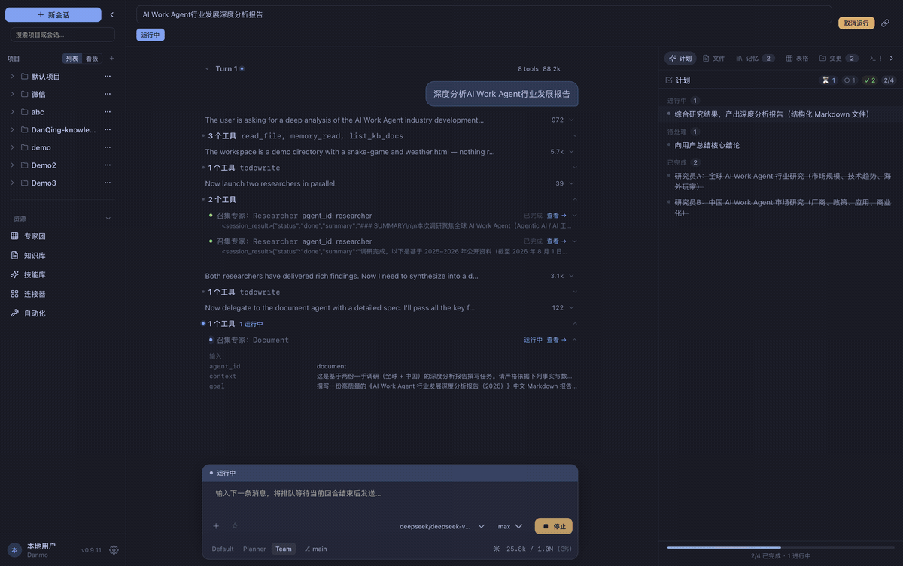

# Danmo Work

[English](README.md) | [中文](README.zh-CN.md)

[](https://github.com/danmo-ai/danmo-work/releases/latest)
[](LICENSE)
[](go.mod)
[](https://github.com/danmo-ai/danmo-work)

**开源 AI 工作 Agent**——多 Agent 协作、跑长程任务的本地工作引擎。写代码、做调研、出报告、做幻灯片、填表格、跑自动化，一条 Agent Loop 全包了。你可以全程看着它干，随时纠正，中断了也能接着跑。自托管，MIT 协议。

- **编排交给模型。** 没有工作流画布这回事。子专家（`delegate_agent`）、向你提问（`ask_user`）、MCP 连接器，本质上都是工具——调哪个、什么时候调，模型规划时自己说了算。
- **Turn Log 就是状态。** 每次工具调用写入 SQLite（`history.db`）。进程崩了能恢复、回合能回放、改工具结果、隔几天接着跑——JSONL 仅作导出。
- **入口随你挑。** Web · 桌面（Tauri）· CLI · TUI · 飞书 / QQ / 微信 / 企微——同一套引擎，工具永远跑在你自己的机器上。

[](docs/screenshots/carousel.html?lang=zh)

[交互轮播（带说明）](docs/screenshots/carousel.html?lang=zh) · [架构演示](docs/demo/product-tour.html?lang=zh) · [Office 协作演示](docs/demo/office-coedit-tour.html?lang=zh&tour=1)

> 代码、报告、幻灯片、表格、演示、自动化——一条链做完。

---

## 亮点

| | |
|--|--|
| **多 Agent 团队** | **Team** 主专家按需委派内置专家——文档、实现、调研、评审、GitHub、网文……各自在独立 sub-turn 里干活，主链上下文保持精简 |
| **File Stage + AI Diff** | 文档 / 幻灯片 / 表格 / 源码 / 网页 / 媒体 / Diff 同台——`routeProjectFile` 路由；回合前快照 → 审阅 hunk → 保留 / 回滚 / 接受 |
| **随时向你请示** | `ask_user` 带选项、带表单；危险 Shell 或外部 MCP 执行前走审批门禁——桌面与 IM 同一套流程 |
| **计划会跟着变** | 计划就是 `todowrite`：边做边更新、验证后才打勾；话题跑偏了就地重写，不会写一次就落灰 |
| **记忆、表与知识库** | `memory_*` 按 user / project / agent 三级作用域；无 schema 的 `table_*` 流水在 `store.db`；Markdown 知识库按章节 FTS 检索 |
| **技能与连接器** | 技能市场（官方目录、Tech Leads Club、ClawHub）、磁盘 Ambient 技能（`~/.agents/skills/`、项目目录）、按 Agent 绑定的 MCP 连接器 |
| **实打实的沙箱** | OS 级隔离（Seatbelt / Landlock / bwrap / WSL2）或可选 Podman/Docker 容器环境；网络 deny / 域名白名单；四种权限模式 |
| **长程会话** | Turn Log 与流式事件在 `history.db`；Compaction 检查点；崩溃后 `RecoverRunning`；会话可跨天、跨周 |
| **自动化与 IM** | cron 定时 + webhook 触发；飞书 / QQ / 微信 / 企微出站直连——进度卡片、提问、审批全在聊天里 |
| **模型、数据都是你的** | Anthropic 原生 + OpenAI 兼容（OpenAI、DeepSeek、GLM（智谱）、通义、Kimi、Gemini、Grok、本地 Ollama……）；数据都在 `~/.danmo-work/` |

---

## 设计

整个系统就三条设计理念（完整架构见 [docs/core-design.md](docs/core-design.md)）：

1. **一切都是工具。** 文件、Shell、网络、记忆、业务表、知识库、子专家（`delegate_agent`），甚至你本人（`ask_user`），共享同一个接口。调谁、何时调，模型说了算。
2. **模型驱动一切。** 没有开发者预先写死的控制流：主专家自己规划、自己委派、自己来找你请示。写代码和跑长程任务，是同一条 Loop 的两种深度，压根不需要「模式切换」。
3. **日志即状态。** 每个 Turn 是 SQLite（`history.db`）里只追加的轨迹。Compaction 检查点、崩溃恢复、回放都是原生能力，不是事后补丁。

### 专家与团队

主专家撑起整个会话，子专家负责专项，随叫随到、上下文隔离（完整清单与用法见 [docs/experts.md](docs/experts.md)）：

| 专家 | 职责 |
|------|------|
| **Team**（主） | 默认可协作；适合跨文件、多步骤任务 |
| **Document** | 职场写作交付：报告默认 Markdown；幻灯片/表格走绑定技能；含邮件/消息润色（原 Comms） |
| **Comms** | 邮件、消息、通知的润色 |
| **Implementer** | 按规格改代码（TDD / debugging 技能） |
| **Explorer** | 只读摸清代码库 |
| **Researcher** | 深度检索与研究 |
| **Reviewer** | 代码与产物审查 |
| **Data** | CSV / JSON 分析与报表 |
| **GitHub** | Issue / PR / Actions / Release |
| **Danmo Make** | 本机图片 / 视频 / 音频生成（需另装 Danmo Make） |
| **Novel Writing** | 长篇小说：立项 → 章合同 → 正文 → 审稿 → 提交 |
| **CodeGraph**（市场） | 代码智能：定义、引用、影响面 |

Composer 里 `@` 一下，或者干脆说一句「让文档专家写份报告」，主专家就知道该委派了。主专家只看子专家交回来的报告，主链上下文保持精简、对 KV Cache 友好。想在 Teams 里自建子专家也行，技能、工具、知识库、连接器随你绑。

专家之外，同一个库里还装着**技能**（工作流：document-writing、playable-slides、TDD、deep-research……）和**连接器**（MCP 集成）。可以从市场装，可以按 Agent 绑，也可以把技能丢进 `~/.danmo-work/skills/` 或 `~/.agents/skills/`。

### File Stage

三栏布局：项目 · Agent 执行流 · 右侧面板（计划 / 文件 / 记忆 / 表存储 / Git / 终端 / 轨迹），正中间是 **File Stage**，由 `routeProjectFile` 按文件路由：`.md` / `.csv` 自研编辑；`.udoc.json` / `.uslides.json` / `.usheet.json` 为 Univer IR 可编辑；`.docx` / `.pptx` / `.xlsx` 只读，转为 IR 后可编；源码进 CodeMirror；HTML / 图片分别为 **web** / **media**。网页上还能点选 DOM 元素做标注，发回 Composer。

改 Office 文件 = 一次普通 Agent 回合 + 一道审阅：

1. **意图** — 选中文字 / 一页 / 几个单元格，写指令 → `[office-edit]`
2. **提案** — Agent 动手改；回合开始前自动留快照
3. **审阅** — 看 Diff：保留、回滚、按 hunk 接受，都行
4. **提交** — 保留即落盘，回滚还原快照；全程轨迹留在 Turn Log

### 安全

- **软门禁** — 四种权限模式（`discuss` / `plan` / `interactive` / `auto`），危险命令与外部 MCP 先问再跑
- **硬沙箱** — OS 级隔离或可选 Podman/Docker 容器环境；网络 `deny`、全开或域名白名单
- `auto_approve` 绝不会静默放行危险命令；IM 里同样能审批

### 通道、远程与自动化

- **IM 同一条 Loop** — 飞书、QQ、微信、企微都是出站直连你自己的账号，不用折腾公网回调；进度卡片、提问、审批全在聊天里呈现，工具照旧跑在本机。
- **Remote Hub** — 配合 [danmo-hub](https://github.com/danmo-ai/danmo-hub) 配对，让远端客户端穿透 NAT 驱动这台电脑。
- **自动化** — cron 定时、webhook 触发，人不在也能让会话自己跑起来。

---

## 安装

| 平台 | 方式 |
|------|------|
| **macOS**（Apple Silicon） | Homebrew 或 `.dmg` |
| **Windows** | 安装包 `.exe` |
| **Linux**（x86_64） | AppImage / `.deb` |

安装包见 [GitHub Releases](https://github.com/danmo-ai/danmo-work/releases/latest)。

### macOS

```bash
brew tap danmo-ai/tap
brew install --cask danmo-work
# 升级：brew update && brew upgrade --cask danmo-work
```

或者 `brew tap danmo-ai/danmo-work https://github.com/danmo-ai/danmo-work.git`，也可以直接从 Releases 下载 `Danmo.Work_*_arm64.dmg`。目前还没过 Apple 公证，首次打开请右键 → **打开**。

### Windows / Linux

- **Windows：** `Danmo.Work_*_x64-setup.exe` — Authenticode 签名启用前，SmartScreen 可能拦一下 → **更多信息 → 仍要运行**。
- **Linux：** `chmod +x Danmo.Work_*_amd64.AppImage && ./…`，或 `sudo apt install ./Danmo.Work_*_amd64.deb`（需要 WebKitGTK）。

### 首次使用

打开应用，在界面（或 `~/.danmo-work/config.yaml`）里填上 LLM API Key、选个模型就行。项目、会话、记忆落在 `~/.danmo-work/`（`work.db` 控制面、`history.db` 回合日志、`store.db` 业务表）。

### 从源码运行

需要同级 [`dq-ui`](https://github.com/danmo-ai/dq-ui)：

```bash
make dev-web   # 后端 :7801 + Vite :5801 → http://localhost:5801/app/
```

---

## 开发

**依赖：** Go 1.26+、Node.js 20+、同级 [`dq-ui`](https://github.com/danmo-ai/dq-ui)。

```bash
make dev-web          # 后端 :7801 + Vite :5801 → http://localhost:5801/app/
make stop             # 停掉所有 DQ_DEV 进程
mkdir -p ~/.danmo-work && cp config.example.yaml ~/.danmo-work/config.yaml
```

构建、打包、测试、环境变量与 CI 见 [`AGENTS.md`](AGENTS.md)，架构见 [`docs/core-design.md`](docs/core-design.md)。

---

## 文档

| 文档 | 说明 |
|------|------|
| [docs/core-design.md](docs/core-design.md) | Agent 架构、工具系统、通道、File Stage |
| [docs/experts.md](docs/experts.md) | 专家使用说明与内置清单 |
| [docs/remote/README.md](docs/remote/README.md) | Remote Hub 配对与隧道协议 |
| [docs/screenshots/README.md](docs/screenshots/README.md) | 产品截图轮播（README 头图） |
| [docs/demo/README.md](docs/demo/README.md) | 架构演示 HTML / GIF / MP4 |
| [evals/dq_harbor/README.md](evals/dq_harbor/README.md) | Terminal-Bench 2.0 评测套件 |
| [AGENTS.md](AGENTS.md) | 贡献者速查 |
| [config.example.yaml](config.example.yaml) | 完整配置参考 |

## 许可证

[MIT](LICENSE)
