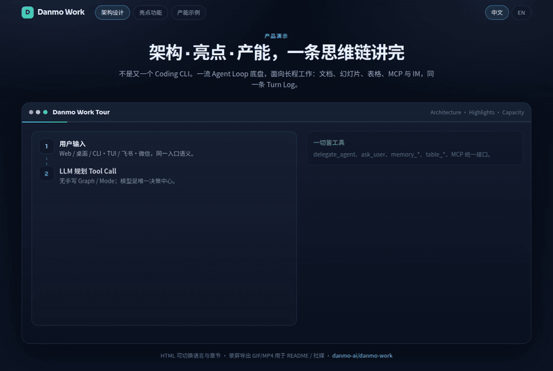

# Danmo Work

[English](README.md) | [中文](README.zh-CN.md)

[](https://github.com/danmo-ai/danmo-work/releases/latest)
[](LICENSE)
[](go.mod)
[](https://github.com/danmo-ai/danmo-work)

**开源 AI Work Agent** — 以一流 Coding Agent 为底盘，面向长程真实工作。可自托管、多 Agent 协作，MIT 协议。

Danmo Work 是人和 AI 一起想、一起做的工作台。同一条 Agent Loop，既能改文件、跑 Shell、做多 Agent 编码，也能在 Document Stage 上**一起改文档、幻灯片和表格**：AI 提案 → 你审阅 → 保留或回滚。每一步 Tool Call 都会落盘，中断可恢复，过程可回放，改完结果还能接着跑。

> 写代码、做调研、出幻灯片、填表格、做演示、跑自动化——Web、桌面、CLI/TUI，或微信 / 飞书 / 企微 / QQ——都在同一条工作链上。

| | |
|--|--|
| **定位** | 通用 **Work Agent**：写代码是核心能力之一，但不是上限 |
| **控制** | **由 LLM 自主规划**，无需手写 Graph、角色路由或产品 Mode |
| **抽象** | **一切皆工具**：委派、提问、记忆、业务表、MCP、文件操作…… |
| **状态** | **日志即状态**：Turn Log 支持恢复、回放，也能改结果再继续 |
| **Office** | Document Stage + AI Diff（保留 / 回滚 / 分块接受）；文本文件始终是真相源 |
| **入口** | Web · 桌面 · CLI · TUI · IM 通道 · Document Stage |

MIT 协议 · 兼容 Anthropic 与 OpenAI 接口 · 数据默认保存在 `~/.danmo-work/`

---

## 安装

| 平台 | 方式 |
|------|------|
| **macOS**（Apple Silicon） | 推荐 Homebrew，或下载 `.dmg` |
| **Windows** | 安装包 `.exe` |
| **Linux**（x86_64） | AppImage / `.deb` |

安装包见 [GitHub Releases](https://github.com/danmo-ai/danmo-work/releases/latest)。

### macOS

```bash
brew tap danmo-ai/tap
brew install --cask danmo-work
# 升级：brew update && brew upgrade --cask danmo-work
```

也可以直接 tap 本仓库：  
`brew tap danmo-ai/danmo-work https://github.com/danmo-ai/danmo-work.git`

或从 Releases 下载 `Danmo.Work_*_arm64.dmg`，拖进「应用程序」。尚未通过 Apple 公证，首次启动请右键 → **打开**。

### Windows

下载 `Danmo.Work_*_x64-setup.exe`。在启用 Authenticode（[SignPath 说明](docs/windows-authenticode.md)）之前，SmartScreen 可能拦截，选择 **更多信息 → 仍要运行** 即可。

### Linux

```bash
chmod +x Danmo.Work_*_amd64.AppImage && ./Danmo.Work_*_amd64.AppImage
# 或：sudo apt install ./Danmo.Work_*_amd64.deb
```

需要带 WebKitGTK 的桌面环境。应用内自动更新走 AppImage 通道。

### 从源码运行

需要同级目录下的 [`dq-ui`](https://github.com/danmo-ai/dq-ui)：

```bash
make dev-web   # → http://localhost:5801/app/
```

在界面或 `~/.danmo-work/config.yaml` 中填入 LLM API Key。更多见 [开发](#开发)。

---

## 亮点

| Danmo Work | 常见做法 |
|------------|----------|
| 一条思维链 + 硬隔离的子 Agent | 多个并行 Session，交接黑盒 |
| Document Stage + **AI Diff**（文档 / 幻灯片 / 表格） | 聊天框里扔一堆 Markdown |
| 对照回合前快照：保留、回滚、按块接受 | AI 直接覆盖文件，改完难撤回 |
| 可查看、可编辑的 Memory + 无固定 Schema 的 Table Store | 黑盒产品记忆，或另接一套向量库 |
| MCP 连接器 + cron / webhook 自动化 | 循环外再拼一堆脚本 |
| 微信 · 飞书 · 企微 · QQ 共用同一 Loop | 先搭公网回调才能接 IM |
| 可恢复、可回放，也能改 Tool 结果再继续 | 出问题只能重开对话碰运气 |

多数方案是：**人编排，模型执行**。  
Danmo Work 是：**模型在同一条链上编排**；你提供能力（Tool / Skill / MCP）；需要人时，通过 `ask_user` 平等参与。

| 维度 | 典型 Coding Agent | Agent 框架 | **Danmo Work** |
|------|-------------------|------------|----------------|
| 主业 | 写代码、提 PR、终端协作 | 搭工作流 / 应用编排 | 长程工作（含编码）+ 可交付产物 |
| 循环 | 强，但偏代码 | 开发者手写 Graph / 角色 | Coding Agent 量级 + 由 LLM 规划 Tool Call |
| 子 Agent | 另开 Session 或挂 Skill | Handoff / Crew | 同链上的 `delegate_agent`，执行隔离 |
| 人机协作 | 审批或聊天打断 | 预设节点 | `ask_user` 工具，由模型决定何时问人 |
| 产物 | 仓库 Diff | 应用自己定义 | Diff + Document Stage + AI Diff 审阅 |
| 持久化 | Session / 容器生命周期 | 可选 Checkpointer | **Turn Log 即状态** |
| 部署 | 多为开源项目 | 开源库 | **MIT，可自托管** |

---

## 工作台



[交互演示](docs/demo/product-tour.html) · [MP4](docs/demo/product-tour-zh.mp4) · [Office 协作演示](docs/demo/office-coedit-tour.html)?lang=zh&tour=1

三栏布局：左侧项目 · 中间 Agent 执行流 · 右侧面板（计划 / 文件 / **记忆** / 变更 / 终端）。中央是 **Document Stage**，会按文件类型切换工具栏。

### 人与 AI 一起改 Office

不是 AI 悄悄改文件，也不是石墨式多人实时协作。Document Stage 上固定四步：

1. **意图** — 选中段落 / 当前页 / 单元格范围，写清指令，工具栏生成 `[office-edit]`
2. **提案** — 走同一条 Agent Loop；回合开始前自动快照
3. **审阅** — 查看 Diff，可整份保留、整份回滚，或按 hunk 接受
4. **落定** — 保留则写入真相源；回滚则恢复快照；全过程记入 Turn Log

| 类型 | 真相源 | 协作范围 |
|------|--------|----------|
| **文档** | GFM `.md` | 选区或全文 |
| **幻灯片** | 用 `---` 分页的 Markdown | 当前页 |
| **表格** | `.csv` / `.danmo-sheet.json` | 选中区域 |
| **预览** | `.html`、图片、外链 | 点选 DOM → 批注 → 写入 Composer |
| **代码 / Diff** | 源码 / git / AI Diff | AI Diff 审阅 |

设计说明见 [`docs/human-ai-coedit-plan.md`](docs/human-ai-coedit-plan.md)。

### 预览页：点哪里改哪里

在 Stage 的 **Preview** 中点选页面元素、写批注、确认后送入 Composer。模型拿到的是精确的 HTML/CSS 上下文，不用靠文字描述「页面左上角那个按钮」。


| 调研报告 | 交互演示 | 网页小游戏 |
|---------|---------|-----------|
|  |  |  |

### IM 通道

在即时通讯里也能用同一套 Agent Loop，工具仍在你本机执行。会话按 `(通道, 账号, 对端)` 隔离，多个通道绑同一项目也不会串聊。

| 通道 | 接入方式 | 说明 |
|------|----------|------|
| **微信** | 手机微信（iLink 长轮询） | 账号默认项目、文字菜单审批、支持收图/文件 |
| **飞书** | 出站 WebSocket | 无需公网 URL；卡片、审批、`/project` |
| **企业微信** | 出站 WebSocket | 管理后台智能机器人；先流式占位，再给出最终回复 |
| **QQ** | 出站 Gateway WebSocket | 键盘审批、C2C 流式、群聊可禁工具、`/project` |

| 桌面端 | 手机端 |
|--------|--------|
|  |  |

### 专家、技能与连接器

在界面里配置的是**能力积木**（提示词、Skill、沙箱、委派），不是工作流图。Composer 里用 `@` 即可召唤技能。

| 专家提示词 | 技能库 | 运行时 |
|-----------|--------|--------|
|  |  |  |

- **专家** — 本地与市场 Agent：提示词、技能、工具、知识库
- **技能** — Agentskills（`SKILL.md`），内置与自定义均可
- **MCP** — 连接器目录映射为 `mcp_<server>_<tool>`；密钥加密存储，高风险操作走权限门禁
- **自动化** — cron / webhook 真正发起 session turn，可用 Turn Log 回放
- **记忆** — `memory_*`（user / project / agent），界面有独立记忆页
- **Table Store** — 无固定 Schema 的 `table_*`，独立落在 `store.db`
- **运行时** — Turn 上限、Tool 输出上限、委派深度、沙箱与网络策略

---

## 设计

### 一切皆工具

| 概念 | 对应工具 |
|------|----------|
| 子 Agent | `delegate_agent` |
| 向用户提问 | `ask_user` |
| 技能 / 知识 | `read_skill` / `search_kb` |
| 记忆 / 业务数据 | `memory_*` / `table_*` |
| 文件 / 外部 API | `read_file` / `edit` / MCP / `web_*` |

一种抽象（Tool）、一种循环（Agent Loop）、一种执行记录（Turn Log）。要加能力，就加 Tool。

### 由 LLM 自主驱动

没有开发者维护的 Graph，也没有产品 Mode 开关——模型自己规划 Tool Call：

```
用户输入 → [LLM] 规划 Tool Call → 执行
  → 需要澄清？ask_user
  → 需要记住？memory_*  |  需要记流水？table_*
  → 需要委派？delegate_agent（隔离子 Agent → 回报）
  → 完成
```

### 日志即状态

每一步 Tool Call（输入、输出、耗时、决策理由）都会完整保存。任务中断可以接着跑，整段过程可以回放；你也可以改掉某次 Tool 结果，让 Agent 从那里继续。

### Memory、Table Store、Knowledge 各司其职

| 存储 | 用途 |
|------|------|
| **Memory** | 模型主动记下的长期偏好与约定 |
| **Table Store** | 可查询的业务数据行，存在 `store.db` |
| **Knowledge** | 人工维护、绑定到 Agent 的文档（`search_kb`） |
| **Compaction** | 上下文过长时的会话内摘要，不等于长期记忆 |

### 概念模型

```
Project/
  └── Session（可跨天、跨周）
        ├── Turn-1  ← 一轮「输入 → 回复」
        │     ├── Step: 调用 LLM
        │     └── Step: 执行 Tool → 把结果喂回
        ├── Turn-2
        ├── ~ Checkpoint（压缩锚点）~
        └── Turn-N
```

| 概念 | 含义 |
|------|------|
| **Project** | 绑定某个目录的任务集合 |
| **Session** | 围绕一个目标的多轮交互 |
| **Turn** | 一轮「输入 → 回复」，内含多个 Step |
| **Step** | Turn 内一次 LLM 请求与响应 |
| **委派 Agent** | 通过 `delegate_agent` 开出的隔离子任务，完成后回报 |

---

## 架构

```
server/   cli/   tui/    frontend/ (Vue 3 + Vite)
    \       \     /       /
     \       \   /       /
      ---- core/bootstrap ----
              |
  core/service ─── core/runtime ─── core/adapter
       |              |                 |
  core/port ←─────────┘    core/adapter/llm
       |                  (Anthropic / OpenAI 兼容 / Mock)
  core/store/sqlite + turnlog + store.db
```

| 层 | 目录 | 职责 |
|----|------|------|
| 入口 | `server/` `cli/` `tui/` | HTTP（Gin）、命令行、终端界面 |
| 前端 | `frontend/` | Vue 3 + Document Stage |
| 启动 | `core/bootstrap/` | 依赖注入与配置装配 |
| 服务 | `core/service/` | Session、Project、Agent、Skill、MCP、通道等 |
| 运行时 | `core/runtime/` | Turn 循环、Prompt、压缩、权限、Tool 执行 |
| 领域 / 端口 | `core/domain/` `core/port/` | 实体与接口 |
| 适配 | `core/adapter/` | LLM 与 IM（飞书 / QQ / 微信 / 企微） |
| 存储 | `core/store/` | `work.db` + Turn Log + `store.db` |

更细的设计见 [`docs/core-design.md`](docs/core-design.md)。

---

## 开发

**环境要求：** Go 1.26+、Node.js 20+，以及同级的 [`dq-ui`](https://github.com/danmo-ai/dq-ui)：

```text
Workspace/
  Danmo-Work/
  dq-ui/
```

### 快速开始

```bash
make dev-web          # 后端 :7801 + Vite :5801 → http://localhost:5801/app/
make dev-desktop      # 后端 + Tauri 桌面
make backend          # 只起后端
make dev-cli          # 命令行（不依赖 server）
make dev-tui          # 终端界面（不依赖 server）
make stop             # 停掉所有 DQ_DEV 进程

mkdir -p ~/.danmo-work
cp config.example.yaml ~/.danmo-work/config.yaml
# 在界面或配置文件里填入 LLM API Key
```

后端已经在跑时：`SKIP_BACKEND=1 make dev-desktop`。

### 构建与打包

```bash
make build-all              # 前端 + Go server/cli/tui
make build-go               # 只编 Go 二进制
make pack-macos-desktop     # .dmg / .app
make pack-linux-desktop     # AppImage / .deb
make pack-windows-desktop   # .exe
make clean                  # 删除 out/
```

```text
out/
  frontend/dist/     # Vite 生产构建（挂在 /app/）
  server/            # danmo-work / danmo-work-cli / danmo-work-tui
  desktop/bundle/    # Tauri 安装包
  env/               # 可选的 OCI agent 环境 tar
  run/               # 开发用的 pid、日志、wrapper
```

### 测试

```bash
make test               # 分层检查 + go test ./...
make test-integration   # 集成测试
```

Harbor Terminal-Bench 2.0（89 题，需本机同步，不进仓库）：[`evals/dq_harbor/README.md`](evals/dq_harbor/README.md) · 成绩：[`COMPARE_RESULTS.md`](evals/dq_harbor/COMPARE_RESULTS.md)。

```bash
make eval-harbor-base
GH_TOKEN=$(gh auth token) make eval-harbor-sync-tb2
make eval-harbor-bin
export WORK_MODEL=... WORK_API_KEY=... WORK_BASE_URL=...
make eval-harbor-smoke
./evals/dq_harbor/compare_agents.sh
```

### 环境变量

| 变量 | 默认值 | 含义 |
|------|--------|------|
| `WORK_CONFIG` | `~/.danmo-work/config.yaml` | YAML 配置路径 |
| `WORK_DB_PATH` | `~/.danmo-work/work.db` | 引擎 SQLite |
| `WORK_STORE_DB_PATH` | `~/.danmo-work/store.db` | Table Store |
| `WORK_DATA_DIR` | `~/.danmo-work/data` | 项目与 turn 日志 |
| `DQ_BACKEND_PORT` | `7801` | 开发后端端口 |
| `DQ_FRONTEND_PORT` | `5801` | 开发前端端口 |
| `VITE_API_BASE_URL` | `""` | 前端 API 基址（空表示同源） |

**自定义技能目录**（Agentskills，每个新 turn 扫描进内存，不写 SQLite）：

| 路径 | 范围 |
|------|------|
| `~/.agents/skills/` · `~/.danmo-work/skills/` | 用户级 |
| `<项目>/.agents/skills/` · `<项目>/.danmo-work/skills/` | 项目级 |

同名时后者覆盖前者。

### CI / 发布

`.github/workflows/release.yml` 在 `v*` tag 或手动触发时构建：macOS `.dmg`/`.app`、Linux AppImage/`.deb`、Windows `.exe`。

macOS 也可通过 Homebrew 安装：`brew tap danmo-ai/tap`（仓库 [`danmo-ai/homebrew-tap`](https://github.com/danmo-ai/homebrew-tap)；cask 源文件 [`Casks/danmo-work.rb`](Casks/danmo-work.rb)）。

---

## 文档

| 文档 | 内容 |
|------|------|
| [docs/core-design.md](docs/core-design.md) | Agent 架构、通道、Stage |
| [docs/human-ai-coedit-plan.md](docs/human-ai-coedit-plan.md) | Office 人机协作设计 |
| [docs/agent-table-store-plan.md](docs/agent-table-store-plan.md) | Table Store（`store.db`） |
| [docs/channel-qq-feishu-plan.md](docs/channel-qq-feishu-plan.md) | IM 通道 |
| [evals/dq_harbor/README.md](evals/dq_harbor/README.md) | Harbor Terminal-Bench 2.0 |
| [AGENTS.md](AGENTS.md) | 贡献者速查 |
| [config.example.yaml](config.example.yaml) | 完整配置参考 |

## 许可证

[MIT](LICENSE)
