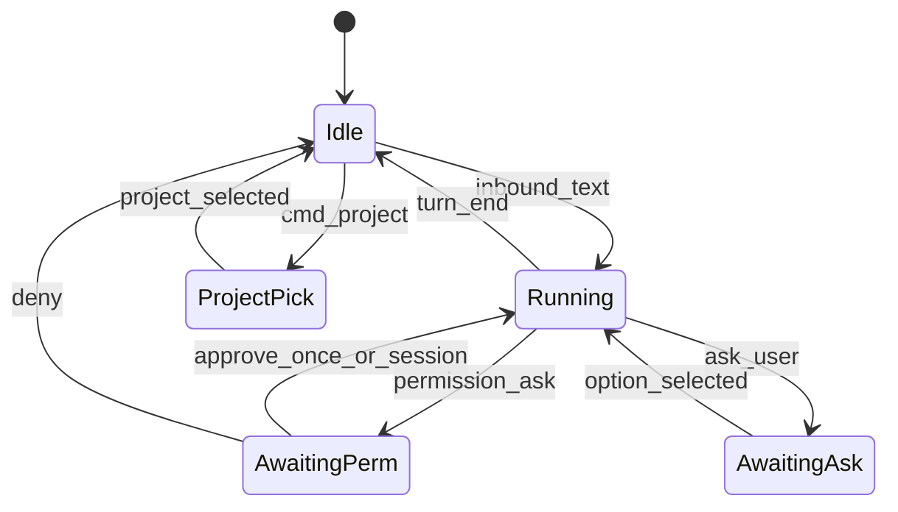

# QQ 渠道支持 + 飞书渠道增强方案

> 目标：移动端完成 **项目切换 / 较丰富事件流 / 审批**，充分利用 QQ 与飞书能力；网络保持 **本机出站**，无需公网业务入口。  
> 范围：IM 通道层；不做独立原生 App / 小程序。

---

## 1. 结论与原则

| 决策 | 说明 |
|------|------|
| **飞书 = 主工作通道** | 交互卡片可更新，适合事件流 + 审批；本仓已有 bridge |
| **QQ = 对等第二通道** | 官方 Bot API（WS Gateway），对齐 OpenClaw qqbot 能力模型；侧重私聊流式、键盘审批、富媒体 |
| **共享通道内核** | 项目绑定、权限呈现、交互回调、进度卡片统一抽象，两端各自渲染 |
| **网络** | 仅出站连平台（飞书长连接 / QQ Gateway）；不暴露 `/api/v1` 给手机 |

原则：

1. **能力用尽平台，交互不降级成纯文本**（除非平台拒绝）。
2. **Ingress 无平台分支**：差异收敛在 Endpoint / Adapter。
3. **桌面仍是完整控制面**；IM 只覆盖三项目标 + 对话。

---

## 2. 目标体验（两端一致）

| 场景 | 用户动作 | 系统行为 |
|------|----------|----------|
| 项目切换 | `/project` 或点选卡片/键盘 | 更新 peer→project 绑定；下轮 turn 进新项目；旧会话不串 |
| 事件流 | 发指令后看一条「进度」消息演进 | 工具 running/done、简短摘要、最终回复同气泡或同卡片更新 |
| 审批 | 点 **允许一次 / 本会话允许 / 拒绝** | 映射 `DecideApproval`；卡片/键盘即时反馈 |
| ask_user | 点选项（或编号兜底） | `ResolveAskUser`；表单字段后续阶段 |

默认：`auto_approve=false` 时手机可批；`true` 时保持静默自动过（兼容现状）。

---

## 3. 共享内核（先做，两端复用）

### 3.1 扩展 Port

[`core/port/channel.go`](../core/port/channel.go)：

```go
ChannelQQ ChannelType = "qq"

type ChannelCapabilities struct {
    ProgressiveStream bool
    RichCards         bool
    InteractiveAsk    bool
    InteractiveApprove bool // NEW: 通道内工具权限按钮
    NativeMedia        bool // NEW: 图/文件等（QQ 优先）
}

// ChannelInteractor 扩展（或新接口）
type ChannelApprover interface {
    PresentPermission(ctx context.Context, in *InboundMessage, ask PermissionPrompt) (handled bool, err error)
}

type PermissionPrompt struct {
    ApprovalID string
    ToolName   string
    Summary    string // 命令/路径摘要
    Scopes     []string // once | session | deny 等
}
```

`OutboundCard` 增加稳定 `CallbackKind`（`ask` / `approve` / `project`）与 `CallbackPayload`，供两端编码到按钮 `value` / `action.data`。

### 3.2 Ingress：权限与交互回调

[`core/service/channel_ingress.go`](../core/service/channel_ingress.go)：

| 改动 | 行为 |
|------|------|
| `EventPermissionAsk` | `autoApprove` → 现逻辑；否则 `PresentPermission`；pending 挂 `(channel,account,peer,approvalID)` |
| 交互回调入口 | `HandleInteraction(InteractionEvent)`：按 kind 分发 `ResolveAskUser` / `DecideApproval` / 项目切换，**不开启新 turn** |
| 进度事件 | `applyEvent` 增加可选 `tool.running` / `tool.completed` / `tool.error` → `ProgressUpdater`（见下） |
| 文本命令 | 拦截 `/project`、`/projects`（及 QQ `/bot-project` 别名）优先于 turn |

新可选接口：

```go
type ProgressUpdater interface {
    UpdateProgress(ctx context.Context, in *InboundMessage, streamID string, progress ProgressSnapshot) error
}

type ProgressSnapshot struct {
    Status   string   // running | tool | done | error
    Headline string
    Lines    []string // 最近 N 条工具摘要
    TextBody string   // 已累积 agent.message
}
```

无 `ProgressUpdater` 时保持今日「只 PATCH agent 文本」。

### 3.3 Per-peer 项目绑定

今日飞书/企微：YAML 全局 `project_id`。增强：

| 层级 | 含义 |
|------|------|
| Channel 默认 `project_id` | 未绑定时的默认项目（设置页必选） |
| `channel_bindings.meta["project_id"]` | **peer 覆盖**；`/project` 写入此处 |
| 解析顺序 | meta.project_id → channel YAML project_id → 报错引导选择 |

复用表 `channel_bindings`（飞书 / 企微 / QQ 共用），无需新表。  
微信多账号模型不动；命令体验对齐即可。

设置页：保留「默认项目」；说明「对话内可 `/project` 切换」。

### 3.4 回调 ID 约定（跨平台）

按钮 payload 紧凑编码，避免超长：

```
dw|<kind>|<id>|<opt>
# kind: a=ask, p=perm, j=project
# 例: dw|p|apr_xxx|once
```

平台侧：飞书 `value`；QQ keyboard `action.data`。

---

## 4. 飞书渠道增强

### 4.1 现状缺口

- 仅 `text` / `post`；卡片 actions → 编号文本  
- 无 `card.action.trigger`  
- 流式 = 文本 PATCH；忽略 tool 事件  
- 权限仅 auto 或等桌面  
- 单全局 project  

### 4.2 目标能力映射

| 能力 | 飞书 API | 实现落点 |
|------|----------|----------|
| 进度卡片 | `msg_type=interactive` 发送 + `PATCH/更新卡片` | `adapter/feishu/outbound.go` + `feishu_endpoint` |
| 审批 / ask | 卡片按钮 + 长连接 `card.action.trigger` | `longconn.go` 注册回调；`HandleInteraction` |
| 项目切换 | 选择器卡片或按钮组 | `PresentProjectPicker` + meta 写入 |
| Markdown 终稿 | `post` 或卡片 markdown 模块 | `FinishStream` 优先更新原卡片 |

**网络**：继续出站 WS；事件 + **回调均走长连接**（`card.action.trigger`），不配公网 callback URL。

### 4.3 进度卡片结构（建议）

```
┌ 标题：执行中 / 已完成 / 失败
├ 正文：agent 文本（截断 +「详见桌面 Turn」）
├ 分区：最近工具（name · status · 一行摘要）
└ 按钮区（按需）：审批 / ask 选项 / 项目
```

更新策略：

1. `StartStream` → 发 interactive「执行中…」  
2. tool / message 事件 → 节流更新同一 `message_id`（≥800ms 或状态变更）  
3. `FinishStream` → 终态卡片（去加载态；保留摘要）  
4. 中途 `permission.ask` → **同一卡片底部换审批按钮**（或追加一条审批卡片，优先同卡）

### 4.4 文件改动清单（飞书）

| 文件 | 改动 |
|------|------|
| `core/adapter/feishu/longconn.go` | 订阅/处理 `card.action.trigger`；ACK；转 `InteractionEvent` |
| `core/adapter/feishu/outbound.go` | `SendInteractiveCard` / `UpdateInteractiveCard`；保留 text/post 降级 |
| `core/adapter/feishu/card_builder.go`（新） | 进度 / 审批 / ask / 项目选择 JSON |
| `core/service/feishu_endpoint.go` | 真 RichCards；`PresentAsk`/`PresentPermission`；`ProgressUpdater` |
| `core/service/feishu_bridge.go` | 回调路由；斜杠命令 |
| `core/service/feishu_peer_project.go`（或 PeerStore 扩展） | meta project 读写 |
| Settings / i18n | 默认关闭 auto_approve 文案；项目切换说明 |
| 测试 | 卡片构建、回调解析、降级路径 |

### 4.5 配置

`ConfigFeishuChannel` 可增：

```yaml
channels:
  feishu:
    auto_approve: false
    rich_progress: true      # 进度卡片；false 则退回文本 PATCH
    project_id: "..."        # 默认项目
```

---

## 5. QQ 渠道支持（新建）

### 5.1 协议选型

对齐 **QQ 开放平台 Bot API v2**（与 OpenClaw `@openclaw/qqbot` / `tencent-connect/openclaw-qqbot` 同层），**不**接入 NapCat/OneBot 非官方协议。

| 项 | 选择 |
|----|------|
| 入站 | WebSocket Gateway（`/gateway` → Identify + Intents） |
| 出站 | HTTPS OpenAPI（回复带 `msg_id` 被动消息） |
| Intents | `GROUP_AND_C2C_EVENT` + `INTERACTION` |
| 主场景 | **C2C 私聊**优先；群 `@` 二期 |
| 流式 | C2C `stream_messages`（`nativeTransport`） |
| 交互 | Markdown + **keyboard**；`INTERACTION_CREATE` → `PUT /interactions/{id}` ACK |
| 媒体 | 入站图/文件下载；出站按需（一期可收图转附件元数据，出站文本+文件二期） |

结构：**Feishu 式拆分**（LongConn 入站 + HTTP Adapter 出站），因 QQ 回复走 REST，不像企微绑在同一条 AI Bot stream 上。Bridge/PeerStore **克隆 WeCom/Feishu 模板**。

### 5.2 能力映射

| 目标 | QQ 能力 | 备注 |
|------|---------|------|
| 事件流 | C2C `stream_messages` + 阶段性 Markdown 刷新 | 群场景无原生 stream → 节流新消息或单条编辑（若开放） |
| 审批 | keyboard：允许一次 / 本会话 / 拒绝 | 对标 OpenClaw Exec Approval |
| ask_user | keyboard 选项 | 文本编号兜底 |
| 项目切换 | `/project` + keyboard 列表 | meta.project_id |
| 富媒体 | 收图片/文件/语音（STT 可选后期） | `NativeMedia=true`；非文本入站进 turn 附件而非丢弃 |

### 5.3 主动消息与时效（风险控制）

| 约束 | 对策 |
|------|------|
| 被动回复窗口有限 | 长任务进度尽量走 **C2C stream** 或同一回复链；避免无 `msg_id` 的主动推 |
| 用户关闭主动消息 | 状态里提示；关键审批必须在用户触达的被动窗口内下发 |
| 频控 | Progress 节流；合并 tool 行 |

### 5.4 新增文件与接线

```
core/port/channel.go              + ChannelQQ, caps, Interaction types
core/domain/weixin.go             + ConfigQQChannel
core/adapter/qq/
  gateway.go                      WS Identify / Resume / Heartbeat
  events.go                       C2C / GroupAt / Interaction 归一化
  api.go                          token、发消息、stream、interaction ACK、媒体
  keyboard.go                     审批/ask/项目键盘
  *_test.go
core/service/qq_bridge.go
core/service/qq_endpoint.go
core/service/qq_peer_store.go     或并入 bridge（同 FeishuPeerStore）
core/bootstrap/bootstrap.go       RegisterRuntime
server/api/v1/qq.go               GET status / PUT configure
server/api/v1/handler.go
frontend/src/stores/qq.ts
frontend Settings 新 tab + i18n
README.zh-CN.md / README.md       通道表增加 QQ
```

配置示例：

```yaml
channels:
  qq:
    enabled: true
    app_id: "..."
    client_secret: "..."
    default_agent_id: "..."
    default_model_id: "..."
    auto_approve: false
    project_id: "..."          # 默认项目
    streaming:
      mode: partial            # partial | off
      native_c2c: true
```

API：`GET/PUT /api/v1/channels/qq`（镜像飞书）。

### 5.5 与 OpenClaw 插件的关系

| | OpenClaw qqbot | 本方案 |
|--|----------------|--------|
| 协议 | 官方 QQ Bot | 相同 |
| 运行时 | OpenClaw Gateway | Danmo `ChannelIngress` + SessionRunner |
| 可复用 | 行为参考（键盘审批、stream、斜杠） | **不依赖**其 npm 包；Go 自研 adapter |
| 差异 | `/bot-approve` 等插件命令 | 统一 `/project` + 权限卡片，风格可兼容别名 |

---

## 6. 统一交互状态机



回调与文本回复共用 `pending*` 表；超时文案：「已超时，请在桌面继续或重新发送」。

---

## 7. 分阶段交付

### Phase A — 共享内核 + 飞书增强（主路径）

1. Port / Ingress：权限呈现、Interaction、progress hook、peer project meta  
2. 飞书 interactive 卡片 + 长连接 card action  
3. 飞书：审批、ask 按钮、`/project`、进度卡片  
4. 设置与文档；单测 + 手工：私聊批工具、切换项目、看 tool 行更新  

**验收：** 飞书手机端可完成三项目标；`auto_approve=false` 不再卡死等桌面。

### Phase B — QQ 渠道 MVP

1. Gateway + C2C 文本往返 + Session 绑定  
2. C2C stream_messages 进度  
3. Keyboard 审批 / ask  
4. `/project` + 设置页  
5. 入站图片（可选：存 data dir，prompt 注路径）  

**验收：** QQ 私聊与飞书同权（项目 / 流 / 审批）；群聊可先只收 `@` 文本。

### Phase C — 能力打满

| 飞书 | QQ |
|------|-----|
| 卡片表单字段（ask formFields） | 群精细策略（requireMention、tool deny） |
| 入站图片/文件 | 出站文件/语音；STT 可选 |
| 多维表格/文档链（非必须） | 主动消息召回与配额提示 |

---

## 8. 测试策略

| 层级 | 内容 |
|------|------|
| Adapter 单测 | 飞书卡片 JSON；回调 value 解析；QQ 事件归一化；keyboard data |
| Ingress 单测 | permission pending；interaction 不新建 turn；project meta 覆盖 |
| Endpoint 单测 | caps；无平台时降级 text |
| 集成（手工/可选） | 真机飞书/QQ：批 `exec_shell`、切项目、长 turn 进度 |

---

## 9. 非目标

- 微信小程序 / 原生移动客户端  
- NapCat / 非官方 QQ 协议  
- 用 IM 复刻完整桌面 Trace / Memory / Settings  
- 飞书「审批」产品（OA Approval）；仅 IM 卡片内工具权限  

---

## 10. 工作量感（子系统，非排期）

| 块 | 规模 | 说明 |
|----|------|------|
| 共享 Ingress / Port / 项目 meta | 中 | 两端前置 |
| 飞书卡片 + 回调 + 进度 | 中大 | 主价值 |
| QQ Gateway + C2C MVP | 大 | 新协议面 |
| QQ keyboard / stream / 媒体 | 中 | 可跟 MVP 同迭代 |
| 设置 / i18n / README | 小 | |

建议顺序：**A → B → C**。若资源只够一条线，优先 **Phase A（飞书）**，QQ 骨架可并行起 `adapter/qq` 但不阻塞飞书验收。

---

## 实施状态（已落地）

Phase A + B + C 已实现于本分支（含验收缺口补齐）：

- 共享 Ingress：权限呈现（含 `StreamID` 同卡审批）、`HandleInteraction`、`/project`、peer `project_id`、进度事件、终态保留 tool 行/失败态、入站媒体落盘、群工具拒绝
- 飞书：schema 2.0 交互卡片/表单、长连接 `card.action.trigger`、进度卡（可挂审批按钮）、`rich_progress` 开关、`auto_approve` 默认 false、图片/文件入站下载
- QQ：Gateway WS、`native_c2c_stream` 开关、C2C stream、keyboard 审批/ask、附件入站、群 `require_mention` 丢弃未 @、群 `deny_tools`、出站文件路径通知（`Meta.file_path`）、主动消息/频控错误提示、设置页与 API
- 非目标仍跳过：多维表格/文档链、STT、完整二进制出站上传

### 微信通道对齐（本分支续作）

- peer `meta.project_id` 持久化（`weixin_bindings.meta_json`），`/project` 真正覆盖账号默认项目
- `InteractiveApprove` + 编号菜单审批；`auto_approve` 新启用默认 false
- 入站图片/文件/语音（无 ASR 时）CDN 下载解密 → `data/channels/weixin/...`
- FinishStream 附带失败标题；无中途气泡编辑（iLink 限制）

---

## 11. 关键代码锚点

| 锚点 | 路径 |
|------|------|
| 通道契约 | `core/port/channel.go` |
| Ingress | `core/service/channel_ingress.go` |
| 飞书出站 | `core/adapter/feishu/outbound.go` |
| 飞书长连接 | `core/adapter/feishu/longconn.go` |
| 企微模板（Bridge） | `core/service/wecom_bridge.go` |
| 配置 | `core/domain/weixin.go` → `ConfigChannelsSection` |
| 绑定表 | `channel_bindings`（sqlite） |
| Bootstrap | `core/bootstrap/bootstrap.go` |
