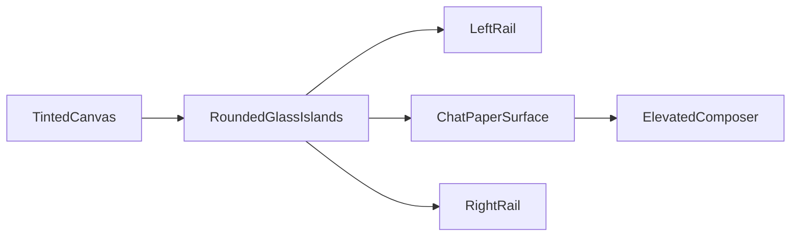
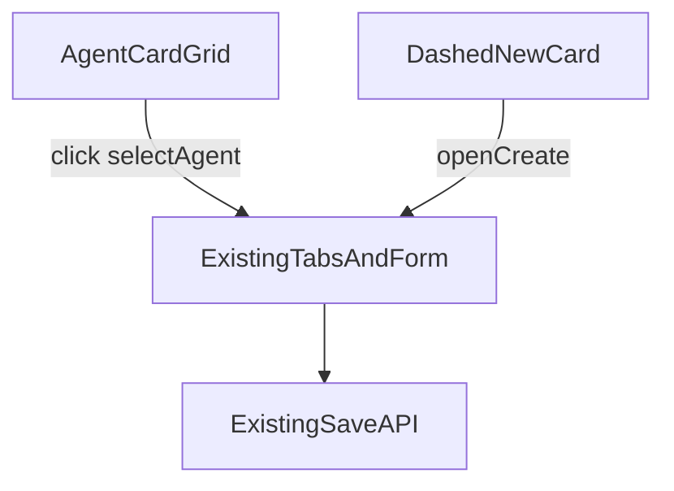

# 前端美化方案（对标 Frakio 观感，不改 API）

> 背景：对比 [Frakio Work](https://github.com/MadsGao/frakio-work) 后，Danmo Work 第一眼更偏「贴边工程工具」，Frakio 更偏 Codex/Arc 式浮岛与橱窗。  
> 范围：**纯前端**（`frontend/`；必要时联动 sibling [`danmo-ai/dq-ui`](https://github.com/danmo-ai/dq-ui)）；**不动 API / DB / domain 数据结构**。  
> 状态：方案文档，待有 dq-ui 写权限的环境落地实现。

---

## 1. 结论与原则

| 决策 | 说明 |
|------|------|
| **壳层浮岛化** | 取消贴边扁平板；padding + gap + 圆角玻璃岛 |
| **专家团上卡下表** | 卡片只浏览/选中；编辑复用现有表单 tabs |
| **技能保持列表** | 技能是选择器不是橱窗；市场浏览可后置卡片 |
| **主题安全** | 美化只消费 `--dq-*` / `--work-*`，不另起色板 |
| **dq-ui 可改** | 缺 token 时上收 tokens/shell；有写权限时与 Work 一并改 |

原则：

1. **好看优先落在壳与橱窗**；Settings / 技能编辑等保持密度。
2. **token 消费者优先**；禁止硬编码大面积色覆盖主题切换。
3. **少量动效**（2–3 处），禁止全局 `* { transition }`。
4. **不抄 Frakio 整站 CSS**；学其几何、分层、人格化，不引入第二套主题系统。

---

## 2. 对标差异（为何「更好看」）

| 维度 | Frakio | Danmo 现状 | 本方案 |
|------|--------|------------|--------|
| 壳 | 12px inset + 圆角浮岛 | 贴边 `border-radius: 0` | 浮岛 + 分层 |
| 字体 | Space Grotesk 等 | `--dq-font-sans` | 仅标题可选展示字体 |
| 主题 | Arc 级 Space 材质 | `applyDqTheme` 全局主题 | **保留** dq 主题；可选上收纸面 token |
| 动效 | motion + stream reveal | 克制 | 仅侧栏 / 流式 / 消息入场 |
| Agent | 人格化卡片 | 窄轨列表 | 上卡下表 |
| Skill | — | 窄轨列表 | **继续列表** |

参考实现（只读对标，勿整包拷贝）：Frakio `apps/web/src/styles.css` 壳层 padding/grid；Agent 配置中心卡片墙。

---

## 3. 主题与 dq-ui 安全边界

### 禁止（会坏主题切换）

- 改 `frontend/src/stores/theme.ts`、`applyDqTheme`、`THEME_OPTIONS`，或私有 html theme class 列表
- 产品 CSS 硬编码大面积 `#fff` / `#121212` / 固定蓝，盖掉 `--dq-bg-*` / `--dq-label-*` / `--dq-accent`
- 全局覆盖 `.dq-*` 组件内部色（如把 `.dq-button` 写成常量色）
- 为浮岛新建并行 dark/light 色表

### 允许

- 只改几何：`padding` / `gap` / `border-radius` / `box-shadow` / `backdrop-filter`
- 颜色继续用 `--work-glass-*`（已映射 `--dq-*`）与 `--dq-bg-page` / `--dq-bg-base` / `--dq-bg-elevated`
- Composer 高对比钮：`var(--dq-label-primary)` 底 + `var(--dq-bg-base)` 字，或现有 `DqButton type="primary"`
- Project / Agent hash 色：只定 **HSL 色相 + 低饱和**，明度用 `color-mix` 混当前 `--dq-*`
- Welcome 氛围：`color-mix(..., var(--dq-accent) ...)`，不独立色板

### 验收主题

在 Settings → 外观切换多个 `THEME_OPTIONS` 后，壳 / 侧栏 / Composer / 专家卡必须跟随，无残留硬编码色块。

---

## 4. dq-ui 联动（有权限时）

Work 依赖 sibling：`file:../../dq-ui/packages/{tokens,ui,shell}`（见 `frontend/package.json`、`frontend/DQ-UI.md`）。

**优先在 Work 用 `color-mix` 映射现有 token。** 下列情况再改 dq-ui：

| 候选上收 | 放哪 | 说明 |
|----------|------|------|
| 纸面表面 `--dq-bg-paper` / elevated chat surface | `@danqing/dq-tokens` | 中栏与侧栏分层，各主题一份 |
| Composer 实心高对比 send 变体 | `@danqing/dq-ui` 或 shell | 避免产品侧覆盖 `.dq-button` |
| 浮岛 inset 间距 / radius 语义 | tokens | 若多产品共用浮岛壳 |
| Agent 摘要卡原子（可选） | `@danqing/dq-shell` | 仅当 Studio/Teams 也要用同一卡 |

落地顺序建议：

1. 电脑端 clone Work + dq-ui 并列目录
2. 先在 Work 打通浮岛（纯 CSS）验证观感
3. 确认缺哪些 token → 开 **dq-ui PR** 加 token/组件
4. Work 改为消费新 token → **Work PR**
5. 两边都过主题切换验收

Cloud Agent 当前对 `danmo-ai/dq-ui` **无 push 权限**；实现请在本机有写权环境推进。

---

## 5. 分阶段落地

### Phase 1 — 壳层（改观最大）

文件：[`frontend/src/styles/work.css`](../frontend/src/styles/work.css)、[`FloatingComposer.vue`](../frontend/src/components/composer/FloatingComposer.vue)

- `.teams-app` / `.teams-shell`：外圈 `padding: 8–12px`、`gap: 10px`；取消强制贴边 `border-radius: 0`
- 左右栏恢复圆角 + 现有 glass（`--work-glass-*` / `--dq-glass-blur-*`）
- 中栏「纸面」surface，与侧栏分层
- Composer：更大圆角、阴影/blur；发送钮高对比圆钮（走 token）

### Phase 2 — 橱窗页

#### 专家团：上卡下表

文件：[`TeamsManagement.vue`](../frontend/src/views/TeamsManagement.vue)

- 本地库去掉窄轨一行列表 → 主区上方 **卡片网格**
- 卡片只读：首字头像 + hash 色、`name`、persona/description 一行、`mode` pill、技能/工具数 chip
- **点击 = 现有 `selectAgent(id)`**；下方保留现有 tab + `agentForm` + footer 保存/删除
- 「+ 新建」虚线卡 → `openCreate()`
- 市场 tab 仍用 `MarketCatalogRail` / `MarketBrowser`
- 未选中：卡片墙 + 空态；选中后下方展开编辑区

**不在卡片上就地编辑** prompt / tools / skills（字段太重，Dialog 不合适）。

#### 技能：保持列表

文件：[`SkillsManagement.vue`](../frontend/src/views/SkillsManagement.vue)

- **不改成卡片墙**
- 可选微增强：一行 description 截断、builtin/market 小标
- 市场目录卡片化可后置

#### Project 色点

文件：[`LeftRail.vue`](../frontend/src/components/left/LeftRail.vue)

- `project.id` hash → 色相；列表左侧色点或首字母圆标
- 纯前端，不写库

#### Welcome 舞台

文件：[`WelcomeEmpty.vue`](../frontend/src/components/center/WelcomeEmpty.vue)

- 强化品牌标题、轻氛围底、prompt chip 轻微
- 仍只用现有文案与 `pickPrompt` 事件

### Phase 3 — 动效（仅 3 处）

尊重 `prefers-reduced-motion`：

1. 侧栏开合：更顺的 `cubic-bezier` + 内容淡入
2. 流式正文：assistant 新片段 ~100–120ms opacity
3. 用户消息 / tool card：短 `translateY + opacity`

### Phase 4 — 收尾

- 展示字体仅用于空态 / 设置 H1 / Agent 名（正文仍 `--dq-font-sans`）
- Settings / 管理页加大 section 间距与弱分组
- 对话列表顶底 `mask-image` 渐隐（可并入 Phase 1）

---

## 6. 明确不做

- 改 API / agent·skill schema / 头像上传后端
- 换掉 dq-ui 或引入整套 Frakio CSS
- 覆盖 `applyDqTheme` / Settings 外观切换
- Arc 级 noise / 旋钮主题编辑器（第二套主题）
- 技能库整页卡片化
- 卡片上就地编辑专家全字段
- 全局过渡动画

---

## 7. 关键文件

| 文件 | 改动 |
|------|------|
| `frontend/src/styles/work.css` | 浮岛壳、分层、共享卡片/色点样式 |
| `frontend/src/components/composer/FloatingComposer.vue` | Composer 抬升 |
| `frontend/src/views/TeamsManagement.vue` | 专家卡片墙 + 下表编辑 |
| `frontend/src/components/left/LeftRail.vue` | Project 色点 |
| `frontend/src/components/center/WelcomeEmpty.vue` | 空态舞台 |
| center 消息 / 流式组件 | 入场 / reveal |
| `dq-ui/packages/tokens`（可选） | 纸面 / 浮岛语义 token |
| `dq-ui/packages/ui` 或 `shell`（可选） | Composer 钮变体、Agent 卡原子 |

---

## 8. 验收清单

- [ ] 主界面第一眼为浮岛分层，非整块贴边板
- [ ] 专家团可卡片浏览；点选后下方编辑与保存与现网一致
- [ ] 技能库仍为列表选择器，编辑路径不变
- [ ] Settings 切换多个主题后，壳 / 卡 / Composer 正确跟随
- [ ] 无 API / 类型 / theme store 契约破坏
- [ ] `frontend` typecheck 通过；若改了 dq-ui：`dq-ui` 下 `pnpm run build` + `typecheck` 通过

---

## 9. 建议实施顺序（本机）

1. Phase 1 壳层（Work only）→ 截图对比
2. Phase 2 专家卡 + Project 色点 + Welcome
3. 若 token 不够干净 → dq-ui PR 上收 → Work 改引用
4. Phase 3 动效 → Phase 4 收尾
5. 多主题回归
